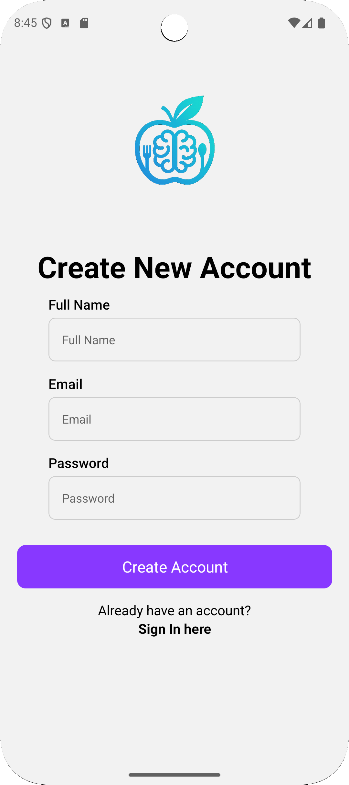
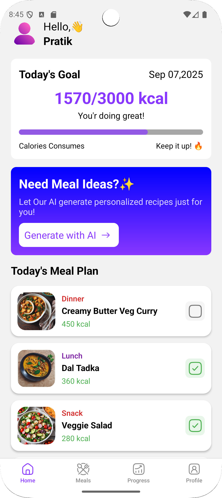
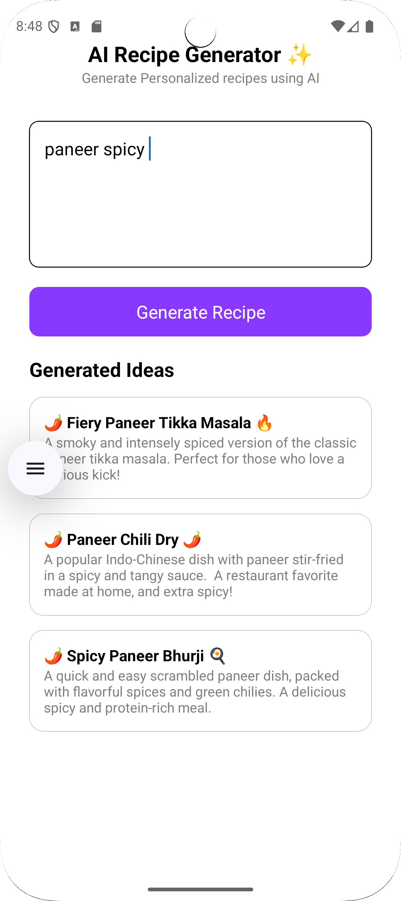
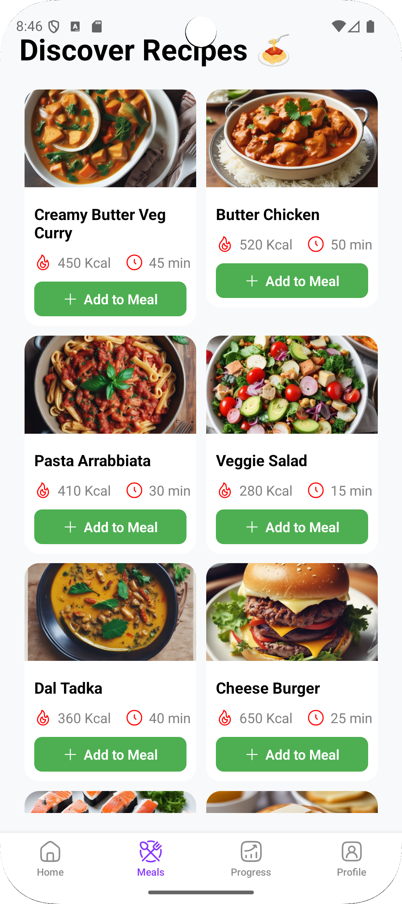
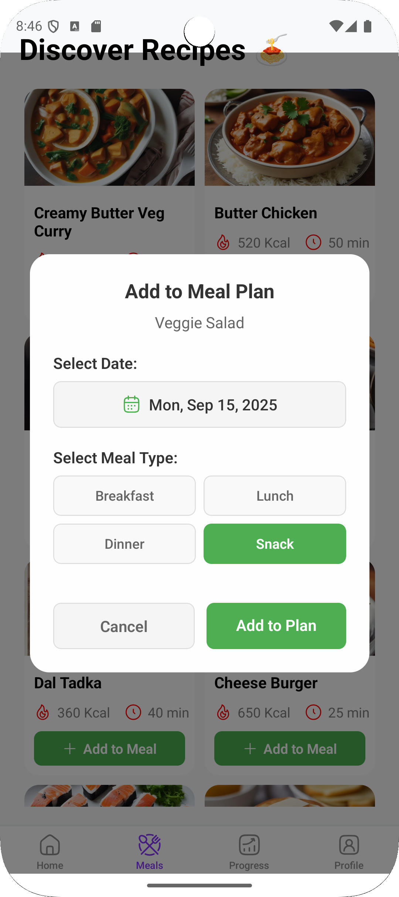
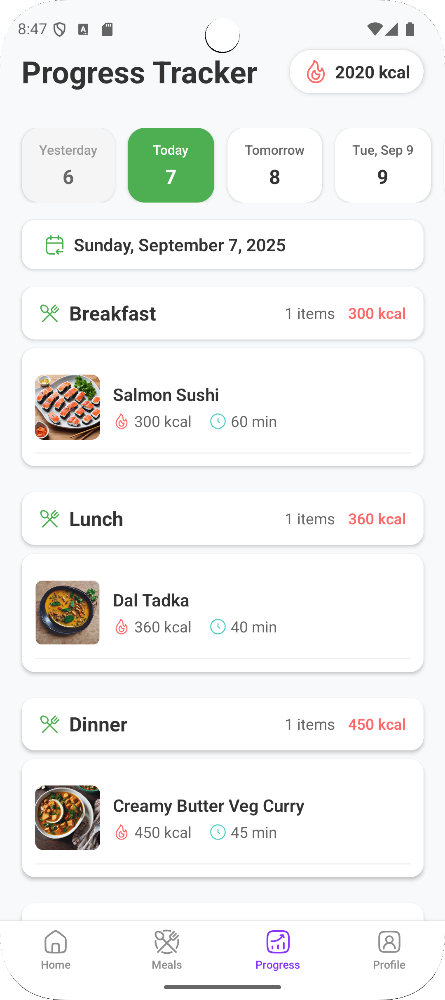

# 🍽️ AI Diet Planner

An AI-powered mobile app built with **React Native (Expo)** and **Convex backend** that helps users plan, track, and review their daily meals.  
The app generates and manages personalized meal plans, tracks calorie intake, and monitors daily progress.

---

## 🚀 Features

- 📅 **Daily Meal Plans**
  - View personalized meal plans for Breakfast, Lunch, Dinner, and Snacks.
  - Add meals from recipes directly to your daily plan.

- ➕ **Add Meal Plan Feature**
  - Pick a recipe and add it to your plan with:
    - Date selector
    - Meal type (Breakfast, Lunch, Dinner, Snack)
    - Calories auto-filled from recipe

- 📊 **Progress Tracking**
  - Track total daily calorie intake.
  - See how you performed vs. your calorie goals.
  - Visual overview of progress in the **Progress** tab.

- 🔍 **Review Past Days**
  - Select any past date to review:
    - Meals eaten
    - Total calories consumed
    - Meal types breakdown

---

## 📸 App Preview

### 🔑 Authentication

  
  

### 🏠 Home & Recipes

  
  

### 📅 Meal Plan

  
  

  

### 📊 Progress

  
  

---

## 🛠️ Tech Stack

- **Frontend:** React Native (Expo), React Navigation, Hugeicons, DateTimePicker  
- **Backend:** [Convex](https://convex.dev) (User DB, Recipes DB, Meal Plan DB)  
- **Storage:** Firebase (recipe images)  
- **Auth:** Expo Auth (SignIn / SignUp)  
- **State Management:** React Context API  

---
